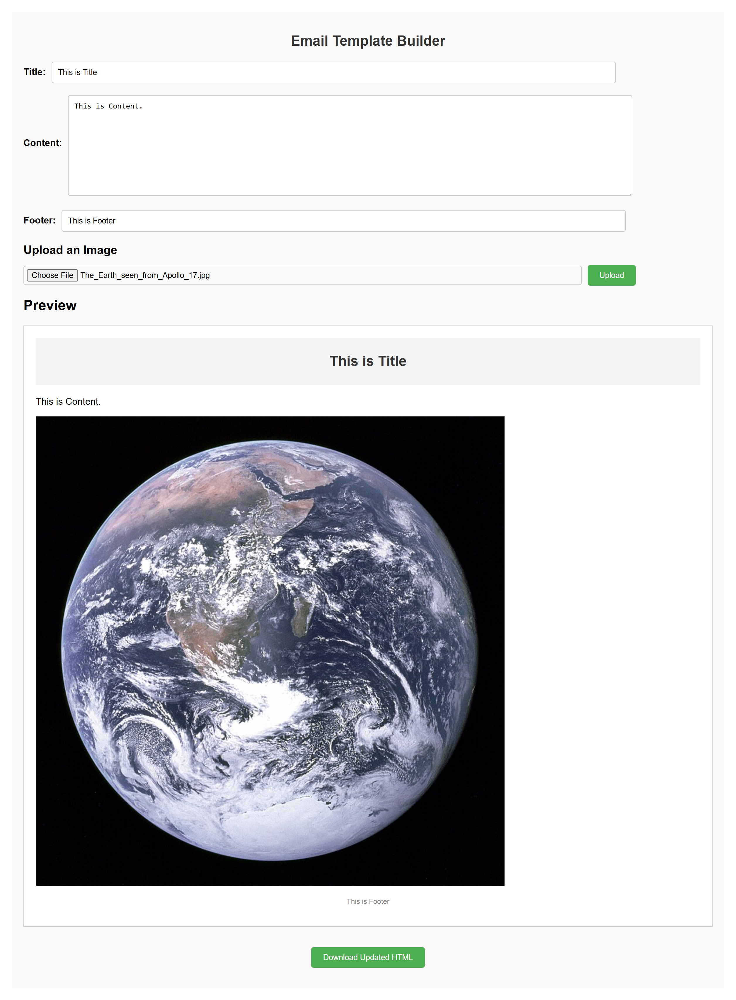

# Install Flask and other dependencies
1) pip install flask flask-cors werkzeug pymongo

# Install npm 
1) cd email-template-builder-frontend
2) npm install
3) npm install axios

#To run
backend - Run 
1) app.py

Then run Frontend
1) cd email-template-builder-frontend
2) npm start

ScreenShots of Email-Builder

